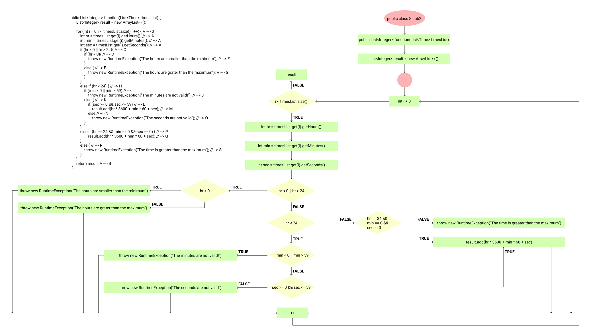
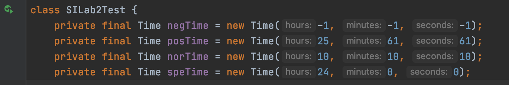
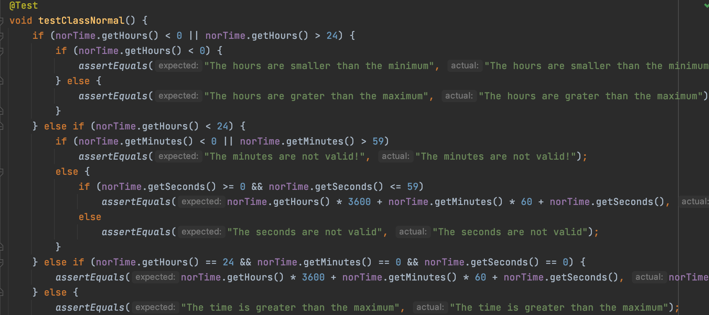
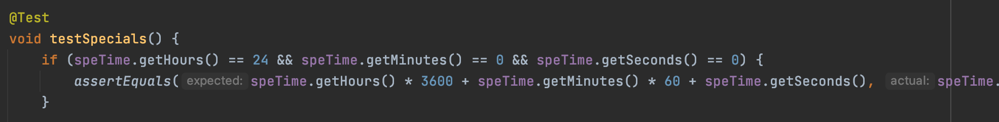

*Софтверско Инженерство, Лабораториска вежба број 2 - Никола Миленковски, 141166*

#### Control Flow Graph (фотографија)

- Цикломатска Комплексност: 8 -> G(g)=E-N+2; N-nodes, E-edges.

- Every Path Method: ACDE, ACDFG, ACHIJ, ACHIKLM, ACHIKNO, ACHPQ, ACHPRS и ACHPRB.

- Multiple Condition Method: CDE, DEF, HIJ, HIP, IJK и KLN. 
  Mетодата се користи за проследување на сите јазли кои одлучуваат во два правца, true или false. 

- Every Branch Method: ACDE, ACHIJ, ACHPQ и ACHPRS.
  Целта на ова метода е да се креираат test cases кои ќе се проследат во јазлите на одлучување, и тоа во двете одлуки.

Gradle кој треба да се сетира претходно се конфигурира во Advanced Settings на компјутерот. Gradle Simple Build се извршува во команд промт. За
IntelliJ Unit Test се прави нов проект, за локација се става каде што е направен Gradle build. По test cases, се доаѓа до заклучок:

Во однос на тестирањето, кодот кој што е даден во вежбата, се копира и се креираат четири нови објекти од Time класата.

Главни тестирања, слики од детален код на едни од тестовите:

